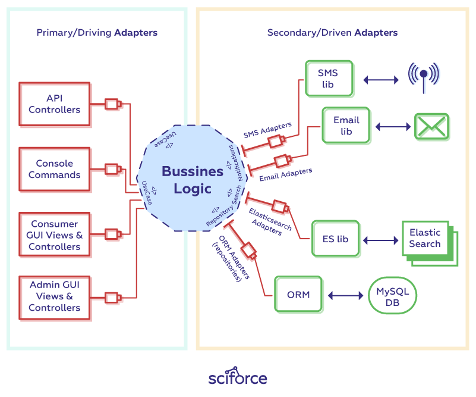

# Development Rules

## 1. Project Architectured (Hexagonal Architecture)

### 1.1. Use the architecture when
  - You want clearly divide software responsibilities into different parts of the program.
  - You want to **decoupled** your code.
  - You want to prevent a change from **propagating** throughout the application.
  - You want to make your application more **maintainable** and **testable**.

    

### 1.2. Hexagonal (Ports and Adapters) Architecture 
  - Inside the Hexagon with all the **business models/logics**, outside the Hexagon: the infrastructure
  - The **dependencies** always go from outside toward the inside of the Hexagon, which ensures the isolation of the **business domain**
  - **Hexagon** depends on nothing but **itself**,It must not depend on any technical frameworks

    

### 1.3. Folder Structure
  ```
  src
    |-- app.module.ts                 // Register Application Module
    |-- application                   // Primary/Driving Adapter
    |   |-- application.module.ts     // Register Controller, Interceptor, ...
    |   |-- controller
    |   |-- decorator
    |   |-- interceptor
    |   |-- event
    |   |-- guard
    |   |-- listener
    |   |-- request
    |-- constant
    |-- domain                        // Business Logic Implementation
    |   |-- domain.module.ts
    |   |-- adapter                   // Adapter or Contract between domain and infrastructure (interface)
    |   |   |-- repository
    |   |-- service                   // Services or Business Login (interface)
    |   |   |-- impl                  // Services implement
    |-- dto                           // Data Transfer Object
    |   |-- command                   // Command from application to domain
    |   |-- query                     // Query or request from domain to infrastructure
    |   |-- response                  // Response return from domain to application
    |   |-- result                    // Result return from infrastructure to domain
    |-- infrastructure                // Secondary/Driven Adapter
    |   |-- database.module.ts        // Config Database Module
    |   |-- infrastructure.module.ts  // Register providers
    |   |-- _config                   // Configuration modules
    |   |-- io                        // I/O databases
    |   |   |-- entity                // Entity model (User, ...)
    |   |   |-- repository            // Model Repository
    |-- main.ts
  ```

## 2. Use Nouns instead of Verbs

  In API development REST approach can be called a resource based. So in your application, you work with resources and their collections (eg. a single book, and a list of all books). The actions on the resources are strictly defined by the HTTP methods such as GET, PUT, POST, PATCH, DELETE

- **Example:**

  - `GET /books/123`
  - `DELETE /books/123`
  - `POST /books`
  - `PUT /books/123`
  - `PATCH /books/123`

## 3. Name the collections using Plural Nouns

  For the collections in REST API development use plural nouns.

- **Example:**

  - `GET /cars/123`
  - `POST /cars`
  - `GET /cars`

## 4. Use resource nesting to show relations or hierarchy

  Resource objects often have some kind of functional hierarchy or are related to each other.

- **Example:**

  - `/users` <- user’s list
  - `/users/123` <- specific user
  - `/users/123/orders` <- orders list that belongs to a specific user
  - `/users/123/orders/0001` <- specific order of a specific user

## 5. Filtering, sorting, paging, and field selection

  Sorting - basically allows sorting the results ascending or descending by a chosen parameter or parameters, eg. by date
  Paging - uses “limit” in order to narrow down the number of results shown to a specific number, and “offset” to specify which part of the results range to be shown - this is important in cases where the number of total results is greater than the one presented, this works like pagination you may encounter on many websites

- **Filtering:**

  - `GET /users?country=USA`
  - `GET /users?creation_date=2019-11-11`
  - `GET /users?creation_date=2019-11-11`

- **Sorting:**

  - `GET /users?sort=birthdate_date:asc`
  - `GET /users?sort=birthdate_date:desc`

- **Paging:**

  - `GET /users?limit=100`
  - `GET /users?offset=2`

- **All together:**

  - `GET /users?country=USA&creation_date=2019-11-11&sort=birthdate_date:desc&limit=100&offset=2`

- **Fields Selection:**

  - `GET /users/123?fields=username,email` (for one specific user)
  - `GET /users?fields=username,email` (for a full list of users)

## 6. Versioning

Versioning your REST API is a good approach to take right from the start. This will allow you to introduce changes to the data structure or specific actions, even if they are breaking/non-backward compatible changes. We are using major version indication only. Example: `https://api.stripe.com/v1/`

## 7. Status Codes

| Code | Constant              | Reason Phrase         |
| ---- | --------------------- | --------------------- |
| 200  | OK                    | OK                    |
| 201  | CREATED               | Created               |
| 202  | ACCEPTED              | Accepted              |
| 204  | NO_CONTENT            | No Content            |
| 400  | BAD_REQUEST           | Bad Request           |
| 401  | UNAUTHORIZED          | Unauthorized          |
| 403  | FORBIDDEN             | Forbidden             |
| 404  | NOT_FOUND             | Not Found             |
| 405  | METHOD_NOT_ALLOWED    | Method Not Allowed    |
| 429  | TOO_MANY_REQUESTS     | Too Many Requests     |
| 500  | INTERNAL_SERVER_ERROR | Internal Server Error |

## 8. Request, Header and Response

### 8.1. Request

  - Query
    - Paging (size=number, page=number)
    - Querying (key=value, keys=value1,value2)
  - Path Variable
    - {id}, {key}, {name} ...
  - Body
    - Json Object
      ```json
      {
        "number": 123,
        "string": "string",
        "boolean": true,
        "object": {},
        "listOfString": ["string"],
        "listOfObject": [{}]
      }
      ```
    - Form Data (multipath, files)

### 8.2. Header

  - Request:

    | Key             | Mendatory | Description                                     | Default Value    |
    | --------------- | --------- | ----------------------------------------------- | ---------------- |
    | Accept-Language | NO        | Application Localization                        | en               |
    | Accept          | NO        | Application Accept Response Type                | application/json |
    | X-Request-ID    | NO        | Identifier of previous request                  | NULL             |
    | Content-Type    | YES       | Request Body Content Type                       | application/json |
    | X-Device-ID     | YES       | Identifier of requesting device                 | NULL             |
    | Authorization   | YES       | Authentication Token like Basic or Bearer token | NULL             |

  - Response:

    | Key                         | Mendatory | Description                                       | Value            |
    | --------------------------- | --------- | ------------------------------------------------- | ---------------- |
    | X-Request-ID                | YES       | Request's Identifier                              | Generated ID     |
    | Content-Type                | YES       | Response Body Content Type                        | application/json |
    | Content-Length              | YES       | Response Content Length                           | Number           |
    | X-RateLimit-Limit           | YES       | Limit time in seconde                             | Number           |
    | X-RateLimit-Remaining       | YES       | Remain Number of rate limited                     | Number           |
    | X-RateLimit-Reset           | YES       | Remain time in seconde with reset the rate number | Number           |
    | Access-Control-Allow-Origin | YES       | Request Origins Allowed                           | \*               |

### 8.3. Response

  - Success

    ```json
    {
      "status": 201,
      "code": "CREATED",
      "message": "User Created",
      "user|book": {
        "key": "value"
      }
    }
    ```

    ```json
    {
      "status": 200,
      "code": "OK",
      "users|books": {
        "users|books": [
          {
            "key": "value"
          }
        ],
        "key": "value"
      }
    }
    ```

  - Failed

    ```json
    {
      "status": 400,
      "code": "BAD_REQUEST",
      "errors": {
        "field name": {
          "validate constrain": ""
        }
      }
    }
    ```

  - Error

    ```json
    {
      "status": 401,
      "code": "UNAUTHORIZED",
      "error": "Unauthorized",
      "message": "Unauthenticated"
    }
    ```

## 9. API Documentation

  It is extremely important to have API documentation published. Not only developers like to know what they are dealing with when making an integration, but this also allows potential users to see what is made available via your API.
